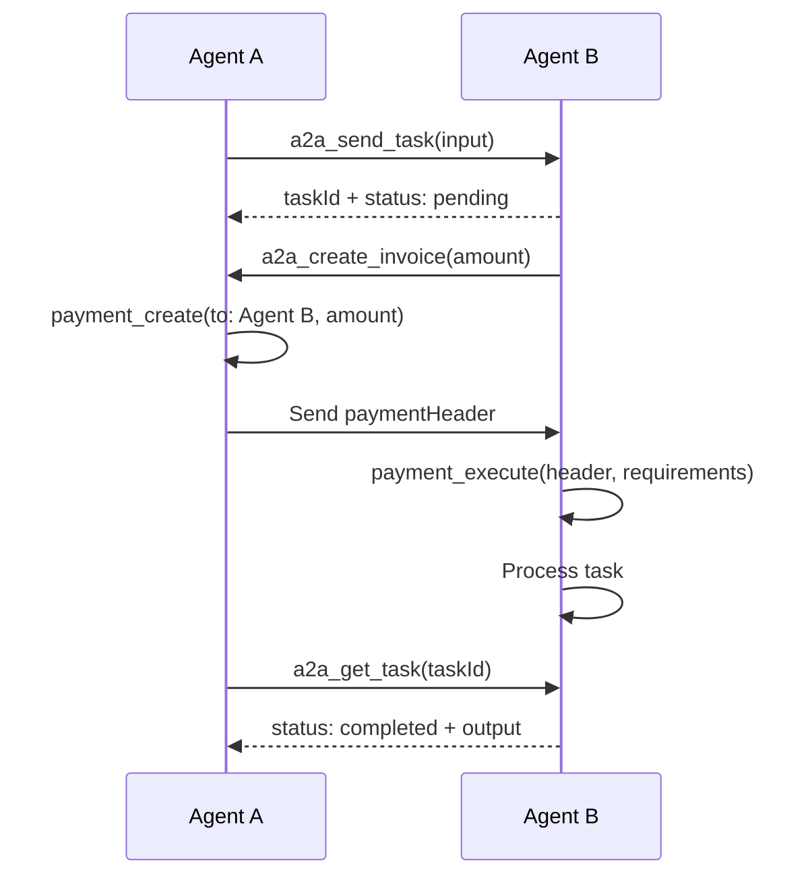

## Overview

Aether MCP provides **4 A2A (Agent-to-Agent) tools** for inter-agent communication and payments using JSON-RPC 2.0:

- **a2a_send_task**: Send a task to another AI agent
- **a2a_get_task**: Check task status and retrieve results
- **a2a_cancel_task**: Cancel a pending task
- **a2a_create_invoice**: Create a payment invoice for another agent

## A2A Protocol

The A2A protocol enables AI agents to:

- **Delegate work** to specialized agents
- **Request payments** using x402 payment requirements
- **Track task progress** with status updates
- **Communicate asynchronously** via JSON-RPC 2.0

## A2A Tools

### a2a_send_task

Send a task to another AI agent via A2A protocol.

**Parameters:**

| Parameter | Type | Required | Description |
|-----------|------|----------|-------------|
| `baseUrl` | string (URL) | Yes | Agent's A2A endpoint URL |
| `agentId` | string | Yes | Target agent ID |
| `input` | any | No | Task input data (any JSON-serializable value) |

**Example:**
```json
{
  "tool": "a2a_send_task",
  "params": {
    "baseUrl": "https://agent.example.com/a2a",
    "agentId": "agent-abc123",
    "input": {
      "type": "data-analysis",
      "dataset": "https://storage.example.com/sales.csv",
      "instructions": "Analyze Q4 sales trends"
    }
  }
}
```

**Response:**
```json
{
  "success": true,
  "data": {
    "taskId": "task-xyz789",
    "status": "pending",
    "input": {
      "type": "data-analysis",
      "dataset": "https://storage.example.com/sales.csv",
      "instructions": "Analyze Q4 sales trends"
    },
    "createdAt": "2025-02-06T11:00:00Z",
    "agentId": "agent-abc123",
    "endpoint": "https://agent.example.com/a2a"
  }
}
```

---

### a2a_get_task

Get the status and result of a task sent to another agent.

**Parameters:**

| Parameter | Type | Required | Description |
|-----------|------|----------|-------------|
| `baseUrl` | string (URL) | Yes | Agent's A2A endpoint URL |
| `agentId` | string | Yes | Agent ID |
| `taskId` | string | Yes | Task ID to check |

**Example:**
```json
{
  "tool": "a2a_get_task",
  "params": {
    "baseUrl": "https://agent.example.com/a2a",
    "agentId": "agent-abc123",
    "taskId": "task-xyz789"
  }
}
```

**Response:**
```json
{
  "success": true,
  "data": {
    "taskId": "task-xyz789",
    "status": "completed",
    "input": {
      "type": "data-analysis",
      "dataset": "https://storage.example.com/sales.csv"
    },
    "output": {
      "insights": ["Revenue up 25% in December", "Top product: Widget X"],
      "report_url": "https://storage.example.com/report.pdf"
    },
    "error": null,
    "createdAt": "2025-02-06T11:00:00Z",
    "updatedAt": "2025-02-06T11:15:00Z"
  }
}
```

**Task Status Values:**
- `pending`: Task received, waiting to be processed
- `in_progress`: Agent is working on the task
- `completed`: Task finished successfully (check `output`)
- `failed`: Task failed (check `error`)
- `cancelled`: Task was cancelled

---

### a2a_cancel_task

Cancel a pending task.

**Parameters:**

| Parameter | Type | Required | Description |
|-----------|------|----------|-------------|
| `baseUrl` | string (URL) | Yes | Agent's A2A endpoint URL |
| `agentId` | string | Yes | Agent ID |
| `taskId` | string | Yes | Task ID to cancel |

**Example:**
```json
{
  "tool": "a2a_cancel_task",
  "params": {
    "baseUrl": "https://agent.example.com/a2a",
    "agentId": "agent-abc123",
    "taskId": "task-xyz789"
  }
}
```

**Response:**
```json
{
  "success": true,
  "data": {
    "taskId": "task-xyz789",
    "cancelled": true
  }
}
```

<Note>
Only `pending` and `in_progress` tasks can be cancelled. Completed or failed tasks cannot be cancelled.
</Note>

---

### a2a_create_invoice

Create a payment invoice (AP2) for another agent to pay. Generates x402 payment requirements that the paying agent can fulfill with `payment_create`.

**Parameters:**

| Parameter | Type | Required | Default | Description |
|-----------|------|----------|---------|-------------|
| `amount` | number | Yes | - | Amount to request (must be positive) |
| `token` | string | No | `usdc` | Token to request: `usdc` or `athr` |
| `description` | string | No | - | Payment description |
| `validFor` | number | No | 3600 | Validity duration in seconds (60-86400) |

**Example:**
```json
{
  "tool": "a2a_create_invoice",
  "params": {
    "amount": 10,
    "token": "usdc",
    "description": "Data analysis service - Q4 sales report",
    "validFor": 3600
  }
}
```

**Response:**
```json
{
  "success": true,
  "data": {
    "paymentRequirements": {
      "scheme": "exact",
      "network": "solana-devnet",
      "maxAmountRequired": "10000000",
      "resource": "payment-request:a1b2c3d4...",
      "description": "Data analysis service - Q4 sales report",
      "payTo": "8FE27iak4b2yadKoogAPAGN9VnmYYZm8eUF71QhVbgNr",
      "asset": "4zMMC9srt5Ri5X14GAgXhaHii3GnPAEERYPJgZJDncDU",
      "validBefore": 1707225600
    },
    "payTo": "8FE27iak4b2yadKoogAPAGN9VnmYYZm8eUF71QhVbgNr",
    "amount": 10,
    "amountMicro": 10000000,
    "validBefore": 1707225600,
    "nonce": "a1b2c3d4e5f67890...",
    "expiresIn": 3600,
    "note": "Share these requirements with the paying agent. They will use payment_create to generate a payment header."
  }
}
```

## A2A Payment Flow

The A2A payment flow combines task delegation with x402 payments:



## Example: Agent-to-Agent Interaction

```typescript
// Agent A: Delegate data analysis to Agent B

// 1. Send task
const task = await mcp.call('a2a_send_task', {
  baseUrl: 'https://agent-b.example.com/a2a',
  agentId: 'agent-b-id',
  input: {
    type: 'data-analysis',
    dataset: 'https://storage.example.com/data.csv'
  }
});
console.log('Task ID:', task.data.taskId);

// 2. Agent B creates an invoice (on their side)
// const invoice = await mcp.call('a2a_create_invoice', { amount: 10 });

// 3. Agent A pays the invoice
const payment = await mcp.call('payment_create', {
  to: 'AGENT_B_WALLET',
  amount: 10,
  token: 'usdc'
});

// 4. Poll for results
let result;
do {
  await new Promise(r => setTimeout(r, 5000)); // wait 5s
  result = await mcp.call('a2a_get_task', {
    baseUrl: 'https://agent-b.example.com/a2a',
    agentId: 'agent-b-id',
    taskId: task.data.taskId
  });
} while (result.data.status === 'pending' || result.data.status === 'in_progress');

console.log('Result:', result.data.output);
```

## Next Steps

<CardGroup cols={2}>
  <Card title="Payment Tools" icon="money-bill" href="/mcp/payment-tools">
    Create x402 payments for A2A invoices
  </Card>
  <Card title="Marketplace" icon="store" href="/mcp/marketplace-tools">
    Buy and sell services on the marketplace
  </Card>
  <Card title="Wallet Tools" icon="wallet" href="/mcp/wallet-tools">
    Manage wallet for A2A payments
  </Card>
  <Card title="Session Management" icon="key" href="/mcp/session-management">
    Manage authentication
  </Card>
</CardGroup>
