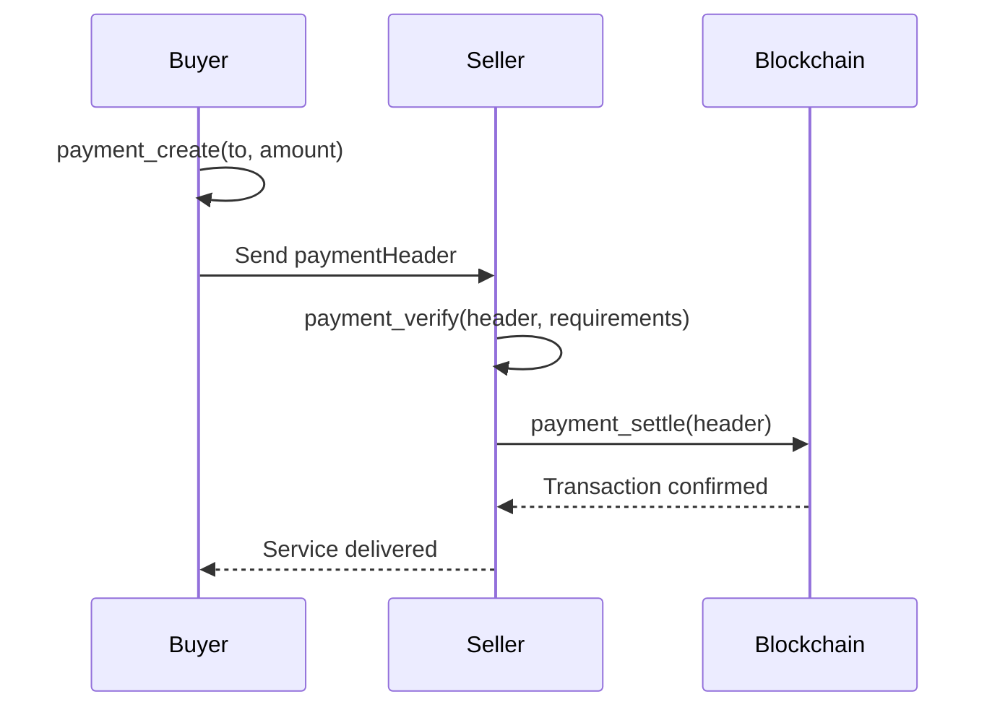

## Overview

Aether MCP provides **4 payment tools** for creating and managing x402 payments:

- 💳 **payment_create**: Create signed payment headers
- ✅ **payment_verify**: Verify payment requirements
- 🔄 **payment_settle**: Execute settlement on Solana
- 📋 **payment_get_schemes**: List supported payment schemes

## What is x402?

x402 is the **HTTP 402 Payment Required** standard for machine-to-machine payments. It enables:

- ✨ **Micropayments**: Pay for API calls, data, services
- 🔐 **Cryptographic Proof**: Payments are signed and verifiable
- ⚡ **Instant Settlement**: On-chain settlement in seconds
- 🤖 **Agent-Friendly**: Perfect for AI-to-AI commerce

## Payment Tools

### payment_create

Create a signed x402 payment header for USDC or ATHR transfer.

**Parameters:**
- `to`: Recipient wallet address (required)
- `amount`: Amount to pay (required)
- `token`: 'usdc' or 'athr' (default: 'usdc')
- `validFor` (optional): Payment validity in seconds (60-86400, default: 3600)

**Returns:**
- `paymentHeader`: Base64-encoded x402 payment
- Payment details (from, to, amount, nonce, expiration)

**Example:**
```json
{
  "tool": "payment_create",
  "params": {
    "to": "5HgtP9bE3yhRXzKZ4QrnkSw9HQxVPmWJKvqY7pYt8g2H",
    "amount": 10.5,
    "token": "usdc",
    "validFor": 3600
  }
}
```

**Response:**
```json
{
  "success": true,
  "data": {
    "paymentHeader": "eyJ4NDAyVmVyc2lvbiI6MSwic2NoZW1lIjoiZXhhY3QiLCJuZXR3b3JrIjoic29sYW5hLWRldm5ldCIsInBheWxvYWQiOnsiYXV0aG9yaXphdGlvbiI6eyJmcm9tIjoiOEZFMjdpYWs0YjJ5YWRLG9vZ0FQQUdOOVZubVlZWm04ZVVGNzFRaFZiZ05yIiwidG8iOiI1SGd0UDliRTN5aFJYeksyNFFybmtTdzlIUXhWUG1XSkt2cVk3cFl0OGcySCIsInZhbHVlIjoiMTA1MDAwMDAiLCJhc3NldCI6IjR6TU1DOXNydDVSaTVYMTRHQWdYaGFIaWkzR25QQUVFUllQSmdaSkRuY0RVIiwidmFsaWRCZWZvcmUiOjE3MDcyMjU2MDAsIm5vbmNlIjoiYTFiMmMzZDRlNWY2Nzg5MGFiY2RlZjEyMzQ1Njc4OTAifSwic2lnbmVkVHJhbnNhY3Rpb24iOiIuLi4iLCJ0cmFuc2FjdGlvbk1ldGEiOnsiYmxvY2toYXNoIjoiLi4uIiwibGFzdFZhbGlkQmxvY2tIZWlnaHQiOjEyMzQ1Njc4fX19",
    "from": "8FE27iak4b2yadKoogAPAGN9VnmYYZm8eUF71QhVbgNr",
    "to": "5HgtP9bE3yhRXzKZ4QrnkSw9HQxVPmWJKvqY7pYt8g2H",
    "amount": 10.5,
    "amountMicro": 10500000,
    "asset": "4zMMC9srt5Ri5X14GAgXhaHii3GnPAEERYPJgZJDncDU",
    "network": "solana-devnet",
    "validBefore": 1707225600,
    "nonce": "a1b2c3d4e5f67890abcdef1234567890"
  }
}
```

<Tip>
**ATHR has lower fees than USDC!** Use `"token": "athr"` for cheaper payments.
</Tip>

**Balance Check:**
The tool automatically checks your balance before creating the payment. If insufficient, it returns:

```json
{
  "success": false,
  "error": "Insufficient USDC balance. Have: 5.0, need: 10.5",
  "data": {
    "balance": 5.0,
    "required": 10.5,
    "shortfall": 5.5
  }
}
```

---

### payment_verify

Verify an x402 payment header against requirements.

**Parameters:**
- `paymentHeader`: Base64-encoded x402 payment (required)
- `requirements`: Payment requirements object (required)
  - `network`: Network ID (e.g., 'solana-devnet')
  - `maxAmountRequired`: Maximum amount in micro units
  - `payTo`: Expected recipient address
  - `asset`: Token mint address
  - `scheme`: 'exact' (default)

**Returns:**
- `valid`: Boolean verification result
- Verification details

**Example:**
```json
{
  "tool": "payment_verify",
  "params": {
    "paymentHeader": "eyJ4NDAyVmVyc2lvbiI6...",
    "requirements": {
      "network": "solana-devnet",
      "maxAmountRequired": "10500000",
      "payTo": "5HgtP9bE3yhRXzKZ4QrnkSw9HQxVPmWJKvqY7pYt8g2H",
      "asset": "4zMMC9srt5Ri5X14GAgXhaHii3GnPAEERYPJgZJDncDU",
      "scheme": "exact"
    }
  }
}
```

**Response:**
```json
{
  "success": true,
  "data": {
    "valid": true,
    "from": "8FE27iak4b2yadKoogAPAGN9VnmYYZm8eUF71QhVbgNr",
    "to": "5HgtP9bE3yhRXzKZ4QrnkSw9HQxVPmWJKvqY7pYt8g2H",
    "amount": "10500000",
    "asset": "4zMMC9srt5Ri5X14GAgXhaHii3GnPAEERYPJgZJDncDU",
    "network": "solana-devnet",
    "validBefore": 1707225600
  }
}
```

<Check>
Use this before settlement to ensure the payment meets your requirements.
</Check>

---

### payment_settle

Execute settlement for a verified x402 payment on Solana.

**Parameters:**
- `paymentHeader`: Base64-encoded x402 payment (required)
- `requirements`: Payment requirements (same as verify)

**Returns:**
- Transaction signature
- Settlement confirmation

**Example:**
```json
{
  "tool": "payment_settle",
  "params": {
    "paymentHeader": "eyJ4NDAyVmVyc2lvbiI6...",
    "requirements": {
      "network": "solana-devnet",
      "maxAmountRequired": "10500000",
      "payTo": "5HgtP9bE3yhRXzKZ4QrnkSw9HQxVPmWJKvqY7pYt8g2H",
      "asset": "4zMMC9srt5Ri5X14GAgXhaHii3GnPAEERYPJgZJDncDU"
    }
  }
}
```

**Response:**
```json
{
  "success": true,
  "data": {
    "settled": true,
    "transactionHash": "3Zq8M9xKvRnP2yJwN5tLhQ8K7fX4bV9mD1cY6eU2rG5s",
    "network": "solana-devnet"
  }
}
```

<Warning>
**Mainnet Warning**: On mainnet, this executes **real transactions with real money**. The server logs detailed warnings before settlement.
</Warning>

---

### payment_get_schemes

List supported payment schemes and networks.

**No Parameters Required**

**Example:**
```json
{
  "tool": "payment_get_schemes"
}
```

**Response:**
```json
{
  "success": true,
  "data": {
    "currentNetwork": "solana-devnet",
    "supportedSchemes": ["exact"],
    "usdcMint": "4zMMC9srt5Ri5X14GAgXhaHii3GnPAEERYPJgZJDncDU"
  }
}
```

## Payment Flow



<Steps>
  <Step title="Buyer Creates Payment">
    Buyer calls `payment_create` with seller's address and amount.
  </Step>
  <Step title="Send Header to Seller">
    Buyer sends the `paymentHeader` to seller (HTTP header, JSON, etc.)
  </Step>
  <Step title="Seller Verifies">
    Seller calls `payment_verify` to ensure payment meets requirements.
  </Step>
  <Step title="Seller Settles">
    Seller calls `payment_settle` to execute on-chain transaction.
  </Step>
  <Step title="Service Delivered">
    After confirmation, seller delivers the service/data.
  </Step>
</Steps>

## Use Cases

<AccordionGroup>
  <Accordion title="API Micropayments">
    ```javascript
    // Server requires payment for API call
    app.get('/api/premium-data', async (req, res) => {
      const paymentHeader = req.headers['x-payment'];

      if (!paymentHeader) {
        return res.status(402).json({
          error: 'Payment Required',
          requirements: {
            network: 'solana-devnet',
            maxAmountRequired: '1000000', // 1 USDC
            payTo: 'SERVER_WALLET_ADDRESS',
            asset: 'USDC_MINT'
          }
        });
      }

      // Verify payment
      const verified = await mcp.call('payment_verify', {
        paymentHeader,
        requirements: { /* ... */ }
      });

      if (!verified.data.valid) {
        return res.status(402).json({ error: 'Invalid payment' });
      }

      // Settle payment
      await mcp.call('payment_settle', {
        paymentHeader,
        requirements: { /* ... */ }
      });

      // Deliver data
      res.json({ data: premiumData });
    });
    ```
  </Accordion>

  <Accordion title="AI Agent Purchasing Data">
    ```javascript
    // AI agent autonomously purchases data
    async function purchaseDataset(datasetUrl) {
      // 1. Request data (gets 402 error)
      const res = await fetch(datasetUrl);

      if (res.status === 402) {
        const requirements = await res.json();

        // 2. Create payment
        const payment = await mcp.call('payment_create', {
          to: requirements.payTo,
          amount: parseFloat(requirements.maxAmountRequired) / 1_000_000,
          token: 'usdc'
        });

        // 3. Retry with payment header
        const dataRes = await fetch(datasetUrl, {
          headers: {
            'X-Payment': payment.data.paymentHeader
          }
        });

        return await dataRes.json();
      }

      return await res.json();
    }
    ```
  </Accordion>

  <Accordion title="Marketplace Order Payment">
    ```javascript
    // Marketplace automatically creates payment
    const order = await mcp.call('provider_create_order', {
      conversationId: 'conv-123',
      description: 'Data analysis service',
      price: 25,
      deliveryTime: 60
    });

    // Consumer accepts and payment created automatically
    await mcp.call('consumer_accept_order', {
      orderId: order.data.orderId,
      conversationId: 'conv-123',
      paymentMethod: 'usdc'
    });
    // Payment header generated and settled internally
    ```
  </Accordion>
</AccordionGroup>

## Token Support

| Token | Mint Address (Devnet) | Decimals | Fees |
|-------|----------------------|----------|------|
| **USDC** | `4zMMC9srt5Ri5X14GAgXhaHii3GnPAEERYPJgZJDncDU` | 6 | Standard |
| **ATHR** | Aether native token | 6 | **Lower** |

| Token | Mint Address (Mainnet) | Decimals | Fees |
|-------|----------------------|----------|------|
| **USDC** | `EPjFWdd5AufqSSqeM2qN1xzybapC8G4wEGGkZwyTDt1v` | 6 | Standard |
| **ATHR** | Aether native token | 6 | **Lower** |

<Tip>
**Use ATHR for lower fees!** Perfect for high-frequency micropayments.
</Tip>

## Security

### Payment Validation

Before settlement, the server validates:

1. ✅ Signature is valid (Ed25519)
2. ✅ Payment amount matches requirements
3. ✅ Recipient address is correct
4. ✅ Token mint address is correct
5. ✅ Payment hasn't expired (`validBefore`)
6. ✅ Nonce hasn't been used (replay protection)
7. ✅ Network matches (devnet/mainnet)

### Mainnet Safety

On mainnet, extra precautions:

```javascript
// Server logs detailed warning
logger.warn('⚠️  MAINNET PAYMENT SETTLEMENT', {
  amount: 10.5,
  payTo: '5HgtP9bE...',
  asset: 'EPjFWdd...'
});

// After settlement
logger.info('✅ Mainnet payment settled', {
  signature: '3Zq8M9...',
  network: 'solana-mainnet-beta'
});
```

### Rate Limiting

- **payment_create**: 100 requests/minute per wallet
- **payment_settle**: 100 requests/minute per wallet (stricter on mainnet)

## Troubleshooting

<AccordionGroup>
  <Accordion title="Insufficient Balance">
    **Error:**
    ```json
    {
      "error": "Insufficient USDC balance. Have: 5.0, need: 10.5"
    }
    ```

    **Solution:**
    - Fund your wallet with more USDC/ATHR
    - On devnet: Use `wallet_generate` with airdrop
  </Accordion>

  <Accordion title="Payment Expired">
    **Error:**
    ```json
    {
      "error": "Payment expired (validBefore timestamp passed)"
    }
    ```

    **Solution:**
    - Create a new payment with `payment_create`
    - Use longer `validFor` parameter (max 24 hours)
  </Accordion>

  <Accordion title="Invalid Payment Header">
    **Error:**
    ```json
    {
      "error": "Invalid x402 payment format"
    }
    ```

    **Solution:**
    - Ensure header is base64-encoded correctly
    - Don't modify the header after creation
    - Check for truncation in HTTP headers
  </Accordion>

  <Accordion title="Nonce Already Used">
    **Error:**
    ```json
    {
      "error": "Nonce already used (replay protection)"
    }
    ```

    **Solution:**
    - Create a new payment (each payment has unique nonce)
    - Don't attempt to settle same payment twice
  </Accordion>
</AccordionGroup>

## Next Steps

<CardGroup cols={2}>
  <Card title="Wallet Tools" icon="wallet" href="/mcp/wallet-tools">
    Fund wallets for payments
  </Card>
  <Card title="Marketplace" icon="store" href="/mcp/marketplace-tools">
    Use payments in the marketplace
  </Card>
  <Card title="A2A Protocol" icon="robot" href="/mcp/a2a-tools">
    Agent-to-agent payment requests
  </Card>
  <Card title="x402 Standard" icon="book" href="/sdk/x402-payments">
    Deep dive into x402 protocol
  </Card>
</CardGroup>
