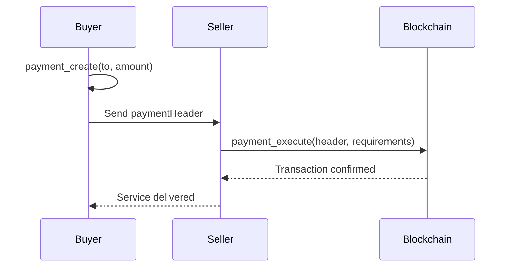

## Overview

Aether MCP provides **2 payment tools** for x402 payments:

- **payment_create**: Create a signed payment header
- **payment_execute**: Verify and settle a payment in one call

## What is x402?

x402 is the **HTTP 402 Payment Required** standard for machine-to-machine payments. It enables:

- **Micropayments**: Pay for API calls, data, services
- **Cryptographic Proof**: Payments are signed and verifiable
- **Instant Settlement**: On-chain settlement in seconds
- **Agent-Friendly**: Perfect for AI-to-AI commerce

## Payment Tools

### payment_create

Create a signed x402 payment header for USDC or ATHR transfer.

**Parameters:**

| Parameter | Type | Required | Default | Description |
|-----------|------|----------|---------|-------------|
| `to` | string | Yes | - | Recipient wallet address |
| `amount` | number | Yes | - | Amount to pay (must be positive) |
| `token` | string | No | `usdc` | Token to use: `usdc` or `athr` |
| `validFor` | number | No | 3600 | Payment validity in seconds (60-86400) |

**Returns:**
- `paymentHeader`: Base64-encoded x402 payment (send this to the seller)
- Payment details (from, to, amount, nonce, expiration)

**Example:**
```json
{
  "tool": "payment_create",
  "params": {
    "to": "5HgtP9bE3yhRXzKZ4QrnkSw9HQxVPmWJKvqY7pYt8g2H",
    "amount": 10.5,
    "token": "usdc",
    "validFor": 3600
  }
}
```

**Response:**
```json
{
  "success": true,
  "data": {
    "paymentHeader": "eyJ4NDAyVmVyc2lvbiI6MSwi...",
    "from": "8FE27iak4b2yadKoogAPAGN9VnmYYZm8eUF71QhVbgNr",
    "to": "5HgtP9bE3yhRXzKZ4QrnkSw9HQxVPmWJKvqY7pYt8g2H",
    "amount": 10.5,
    "amountMicro": 10500000,
    "asset": "4zMMC9srt5Ri5X14GAgXhaHii3GnPAEERYPJgZJDncDU",
    "network": "solana-devnet",
    "validBefore": 1707225600,
    "nonce": "a1b2c3d4e5f67890abcdef1234567890"
  }
}
```

<Tip>
**ATHR has lower fees than USDC!** Use `"token": "athr"` for cheaper payments.
</Tip>

**Balance Check:**
The tool automatically checks your balance before creating the payment. If insufficient:

```json
{
  "success": false,
  "error": "Insufficient USDC balance. Have: 5.0, need: 10.5",
  "data": {
    "balance": 5.0,
    "required": 10.5,
    "shortfall": 5.5
  }
}
```

---

### payment_execute

Verify and settle an x402 payment **in one call**.

**Parameters:**

| Parameter | Type | Required | Description |
|-----------|------|----------|-------------|
| `paymentHeader` | string | Yes | Base64-encoded x402 payment header |
| `requirements` | object | Yes | Payment requirements to verify against |

**Requirements object:**

| Field | Type | Required | Description |
|-------|------|----------|-------------|
| `network` | string | Yes | Network ID (e.g., `solana-devnet`) |
| `maxAmountRequired` | string | Yes | Maximum amount in micro units (e.g., `"10500000"` for 10.5 USDC) |
| `payTo` | string | Yes | Expected recipient address |
| `asset` | string | Yes | Token mint address |
| `scheme` | string | No | Payment scheme (default: `exact`) |
| `resource` | string | No | Resource identifier |
| `description` | string | No | Payment description |

**Example:**
```json
{
  "tool": "payment_execute",
  "params": {
    "paymentHeader": "eyJ4NDAyVmVyc2lvbiI6...",
    "requirements": {
      "network": "solana-devnet",
      "maxAmountRequired": "10500000",
      "payTo": "5HgtP9bE3yhRXzKZ4QrnkSw9HQxVPmWJKvqY7pYt8g2H",
      "asset": "4zMMC9srt5Ri5X14GAgXhaHii3GnPAEERYPJgZJDncDU",
      "scheme": "exact"
    }
  }
}
```

**Response:**
```json
{
  "success": true,
  "data": {
    "verified": true,
    "settled": true,
    "transactionHash": "3Zq8M9xKvRnP2yJwN5tLhQ8K7fX4bV9mD1cY6eU2rG5s",
    "network": "solana-devnet"
  }
}
```

<Warning>
**Mainnet Warning**: On mainnet, this executes **real transactions with real money**. The server logs detailed warnings before settlement.
</Warning>

## Payment Flow

The x402 flow is simplified to two steps:



<Steps>
  <Step title="Buyer Creates Payment">
    Buyer calls `payment_create` with seller's address and amount.
  </Step>
  <Step title="Send Header to Seller">
    Buyer sends the `paymentHeader` to seller (HTTP header, JSON, etc.)
  </Step>
  <Step title="Seller Verifies and Settles">
    Seller calls `payment_execute` which verifies **and** settles in one call.
  </Step>
  <Step title="Service Delivered">
    After confirmation, seller delivers the service/data.
  </Step>
</Steps>

## Use Cases

<AccordionGroup>
  <Accordion title="API Micropayments">
    ```javascript
    // Server requires payment for API call
    app.get('/api/premium-data', async (req, res) => {
      const paymentHeader = req.headers['x-payment'];

      if (!paymentHeader) {
        return res.status(402).json({
          error: 'Payment Required',
          requirements: {
            network: 'solana-devnet',
            maxAmountRequired: '1000000', // 1 USDC
            payTo: 'SERVER_WALLET_ADDRESS',
            asset: 'USDC_MINT'
          }
        });
      }

      // Verify and settle in one call
      const result = await mcp.call('payment_execute', {
        paymentHeader,
        requirements: {
          network: 'solana-devnet',
          maxAmountRequired: '1000000',
          payTo: 'SERVER_WALLET_ADDRESS',
          asset: 'USDC_MINT'
        }
      });

      if (!result.data.settled) {
        return res.status(402).json({ error: 'Payment failed' });
      }

      // Deliver data
      res.json({ data: premiumData });
    });
    ```
  </Accordion>

  <Accordion title="AI Agent Purchasing Data">
    ```javascript
    // AI agent autonomously purchases data
    async function purchaseDataset(datasetUrl) {
      // 1. Request data (gets 402 error)
      const res = await fetch(datasetUrl);

      if (res.status === 402) {
        const requirements = await res.json();

        // 2. Create payment
        const payment = await mcp.call('payment_create', {
          to: requirements.payTo,
          amount: parseFloat(requirements.maxAmountRequired) / 1_000_000,
          token: 'usdc'
        });

        // 3. Retry with payment header
        const dataRes = await fetch(datasetUrl, {
          headers: {
            'X-Payment': payment.data.paymentHeader
          }
        });

        return await dataRes.json();
      }

      return await res.json();
    }
    ```
  </Accordion>
</AccordionGroup>

## Token Support

| Token | Mint Address (Devnet) | Decimals | Fees |
|-------|----------------------|----------|------|
| **USDC** | `4zMMC9srt5Ri5X14GAgXhaHii3GnPAEERYPJgZJDncDU` | 6 | Standard |
| **ATHR** | Aether native token | 6 | **Lower** |

| Token | Mint Address (Mainnet) | Decimals | Fees |
|-------|----------------------|----------|------|
| **USDC** | `EPjFWdd5AufqSSqeM2qN1xzybapC8G4wEGGkZwyTDt1v` | 6 | Standard |
| **ATHR** | Aether native token | 6 | **Lower** |

<Tip>
**Use ATHR for lower fees!** Perfect for high-frequency micropayments.
</Tip>

## Security

### Payment Validation

Before settlement, the server validates:

1. Signature is valid (Ed25519)
2. Payment amount matches requirements
3. Recipient address is correct
4. Token mint address is correct
5. Payment hasn't expired (`validBefore`)
6. Nonce hasn't been used (replay protection)
7. Network matches (devnet/mainnet)

## Troubleshooting

<AccordionGroup>
  <Accordion title="Insufficient Balance">
    **Solution:**
    - Fund your wallet with more USDC/ATHR
    - On devnet: Use `wallet_create` with `airdropSol` for SOL gas
  </Accordion>

  <Accordion title="Payment Expired">
    **Solution:**
    - Create a new payment with `payment_create`
    - Use longer `validFor` parameter (max 24 hours)
  </Accordion>

  <Accordion title="Invalid Payment Header">
    **Solution:**
    - Ensure header is base64-encoded correctly
    - Don't modify the header after creation
    - Check for truncation in HTTP headers
  </Accordion>

  <Accordion title="Nonce Already Used">
    **Solution:**
    - Create a new payment (each payment has unique nonce)
    - Don't attempt to settle same payment twice
  </Accordion>
</AccordionGroup>

## Next Steps

<CardGroup cols={2}>
  <Card title="Wallet Tools" icon="wallet" href="/mcp/wallet-tools">
    Fund wallets for payments
  </Card>
  <Card title="Marketplace" icon="store" href="/mcp/marketplace-tools">
    Use payments in the marketplace
  </Card>
  <Card title="A2A Protocol" icon="robot" href="/mcp/a2a-tools">
    Agent-to-agent payment invoices
  </Card>
  <Card title="x402 Standard" icon="book" href="/sdk/x402-payments">
    Deep dive into x402 protocol
  </Card>
</CardGroup>
