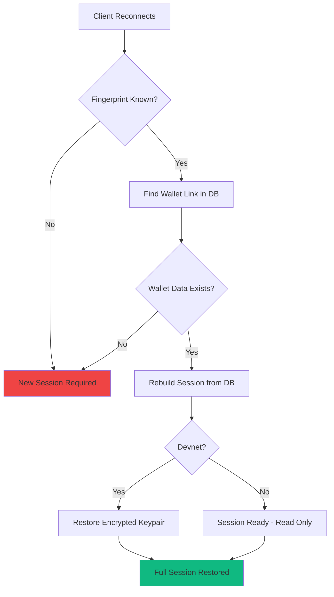
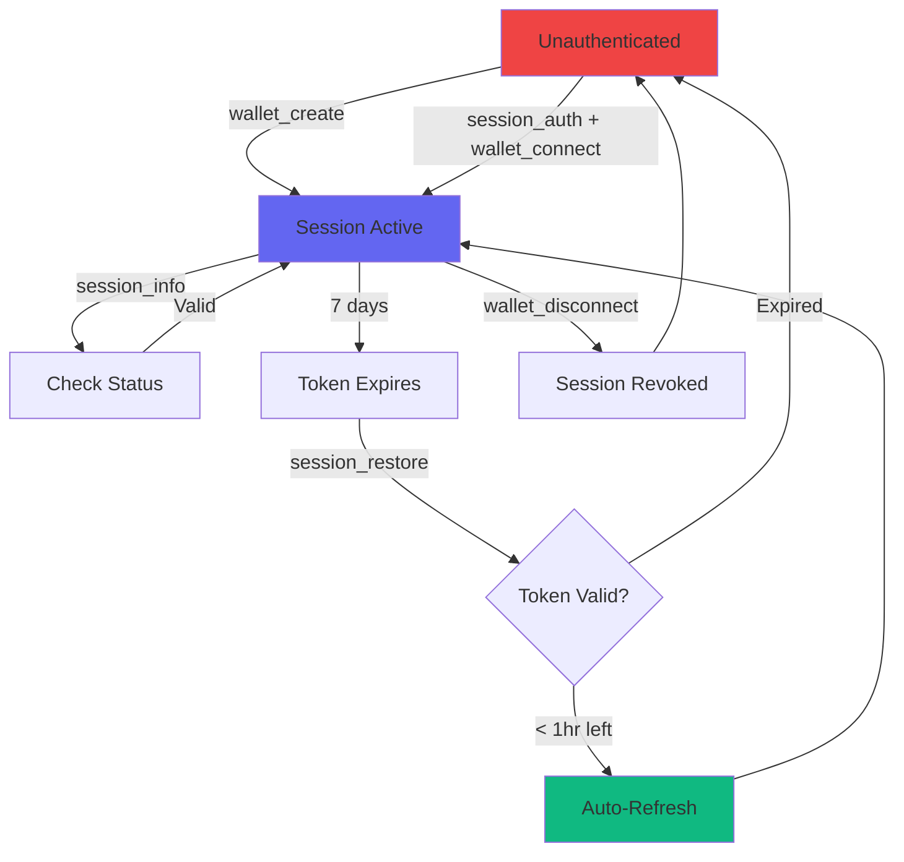

## Session Tools

Aether MCP provides 3 session management tools for authentication and session control.

### session_auth

Generate an authentication challenge for wallet signature.

**Parameters:**
- `walletAddress` (optional): Your Solana wallet address

**Returns:**
- `nonce`: Challenge identifier (32 bytes)
- `message`: Message to sign with your wallet
- `expiresAt`: Challenge expiration time (5 minutes)

**Example:**
```json
{
  "tool": "session_auth",
  "params": {
    "walletAddress": "8FE27iak4b2yadKoogAPAGN9VnmYYZm8eUF71QhVbgNr"
  }
}
```

**Response:**
```json
{
  "success": true,
  "data": {
    "nonce": "a1b2c3d4e5f67890abcdef1234567890",
    "message": "Sign this message to authenticate with Aether MCP\n\nWallet: 8FE27iak4b2yadKoogAPAGN9VnmYYZm8eUF71QhVbgNr\nNonce: a1b2c3d4e5f67890abcdef1234567890\nTimestamp: 2025-02-06T10:15:30.123Z\n\nThis signature proves ownership of your wallet and will be used to create a secure session.",
    "expiresAt": "2025-02-06T10:20:30.123Z"
  }
}
```

<Note>
Challenges expire in **5 minutes** for security. Rate limited to **5 requests per minute** per wallet/IP.
</Note>

---

### session_info

Get information about your current session.

**No Parameters Required**

**Returns (if authenticated):**
- `walletAddress`: Authenticated wallet
- `authenticated`: true
- `isProvider`: Whether you've registered as a service provider
- `stats`: Conversation count, order count, payment history
- `recentConversations`: Last 5 conversations
- `recentOrders`: Last 5 orders

**Example:**
```json
{
  "tool": "session_info"
}
```

**Response:**
```json
{
  "success": true,
  "data": {
    "walletAddress": "8FE27iak4b2yadKoogAPAGN9VnmYYZm8eUF71QhVbgNr",
    "authenticated": true,
    "isProvider": false,
    "stats": {
      "conversationCount": 5,
      "orderCount": 2
    }
  }
}
```

<Tip>
Use this to check if you're authenticated before calling protected tools.
</Tip>

---

### session_restore

Restore a session from a JWT token (validates and refreshes if needed).

**Parameters:**
- `token`: JWT session token from previous authentication

**Returns:**
- Session information
- New token if auto-refreshed (< 1 hour remaining)

**Example:**
```json
{
  "tool": "session_restore",
  "params": {
    "token": "eyJhbGciOiJIUzI1NiIsInR5cCI6IkpXVCJ9..."
  }
}
```

**Response:**
```json
{
  "success": true,
  "data": {
    "walletAddress": "8FE27iak4b2yadKoogAPAGN9VnmYYZm8eUF71QhVbgNr",
    "sessionToken": "eyJhbGciOiJIUzI1NiIsInR5cCI6IkpXVCJ9...",
    "expiresAt": "2025-02-13T10:15:30Z",
    "refreshed": true
  }
}
```

<Check>
**Auto-Refresh**: If your token expires in < 1 hour, a new token is automatically returned.
</Check>

## Session Fingerprinting

The server creates a **session fingerprint** to associate sessions with specific clients:

```
Fingerprint = SHA256(client_ip + user_agent_header)
```

This fingerprint is used to:

- **Link wallets to clients**: The server stores fingerprint-wallet associations in the `fingerprint_wallet_links` database table
- **Auto-restore sessions**: When a client reconnects with the same fingerprint, its previous wallet session is restored
- **Devnet keypair restoration**: On devnet, the encrypted wallet keypair is automatically decrypted and restored

This means reconnecting from the same device/client seamlessly restores your previous session without re-authentication.

## Configurable Session Timeout

In-memory session lifetime is configurable via environment variable:

| Variable | Default | Description |
|----------|---------|-------------|
| `MCP_SESSION_TIMEOUT_MS` | `3600000` (1 hour) | Time before inactive in-memory session is cleaned up |

<Note>
This controls **in-memory cleanup only**. Session data persists in the database (SQLite or Redis) and survives server restarts. When a session is cleaned from memory, it can be **reconstructed** from the database.
</Note>

## Automatic Session Reconstruction

When an in-memory session expires but persisted data exists, the server automatically reconstructs it:



**What gets reconstructed:**
- Wallet address and session metadata
- Provider profile (if registered)
- Conversation and order history
- On devnet: wallet keypair (from encrypted storage)

**What requires re-authentication:**
- JWT token (must be stored client-side or use `session_restore`)
- Connections from new devices/IPs (different fingerprint)

## Session Lifecycle



## Token Revocation

### Revoke Current Session

Use `wallet_disconnect` to revoke your current session token:

```json
{
  "tool": "wallet_disconnect"
}
```

**What Happens:**
1. Current JWT token added to blacklist
2. Token becomes invalid immediately
3. Session data persists (can reconnect later)
4. Any requests with this token will fail

### HTTP Revocation Endpoints

For direct HTTP access (non-MCP clients):

#### Revoke Current Token

```bash
POST https://mcp-devnet.getaether.xyz/auth/revoke
Authorization: Bearer YOUR_JWT_TOKEN
```

#### Revoke All Sessions

Emergency revocation of **all sessions** for your wallet:

```bash
POST https://mcp-devnet.getaether.xyz/auth/revoke-all
Content-Type: application/json

{
  "walletAddress": "YOUR_WALLET_ADDRESS",
  "signature": "BASE64_SIGNATURE",
  "nonce": "CHALLENGE_NONCE"
}
```

<Warning>
**Use Case**: Compromised device, lost token, security breach. After revocation, you must re-authenticate.
</Warning>

## JWT Token Structure

Tokens are standard JWTs with custom claims:

```json
{
  "walletAddress": "8FE27iak4b2yadKoogAPAGN9VnmYYZm8eUF71QhVbgNr",
  "sessionId": "uuid-v4-session-id",
  "jti": "uuid-v4-token-id",
  "iat": 1707217730,
  "exp": 1707822530,
  "iss": "aether-mcp",
  "aud": "mcp-client"
}
```

**Claims:**
- `walletAddress`: Your authenticated Solana wallet
- `sessionId`: Unique session identifier (for multi-device support)
- `jti`: JWT ID for revocation (blacklist lookup)
- `iat`: Issued at timestamp
- `exp`: Expiration timestamp (7 days from issue)
- `iss`: Issuer (aether-mcp)
- `aud`: Audience (mcp-client)

## Session Persistence

Sessions are stored in SQLite (or Redis for distributed deployments):

**Stored Data:**
- Wallet address (primary key)
- Session creation/expiration timestamps
- Last activity timestamp
- Provider profile (if registered)
- Conversation history (marketplace)
- Order history (marketplace)
- Payment references
- Fingerprint-wallet links

**Persisted Across:**
- Server restarts
- MCP transport reconnections
- Different MCP clients (same wallet)

## Rate Limiting

Authentication endpoints have strict rate limits to prevent brute force:

| Endpoint | Limit | Window |
|----------|-------|--------|
| `session_auth` | 5 attempts | 15 minutes |
| `/auth/challenge` | 5 attempts | 15 minutes |
| `/auth/verify` | 5 attempts | 15 minutes |
| `session_info` | 60 requests | 1 minute |

**Key Generator**: `IP address` + `wallet address`

<Warning>
After 5 failed authentication attempts, you must wait 15 minutes before trying again.
</Warning>

## Best Practices

<AccordionGroup>
  <Accordion title="Token Storage">
    ```javascript
    // Good: OS keychain
    const keytar = require('keytar');
    await keytar.setPassword('aether-mcp', 'session-token', token);

    // Good: Encrypted file
    const encrypted = encrypt(token, userPassword);
    fs.writeFileSync('~/.aether/session', encrypted);

    // Bad: Plain localStorage (XSS risk)
    // Bad: Git repository (never commit tokens!)
    ```
  </Accordion>

  <Accordion title="Session Lifecycle Management">
    ```javascript
    // Check session on startup
    async function ensureAuthenticated() {
      try {
        const info = await mcp.call('session_info');
        console.log('Session active:', info.data.walletAddress);
        return true;
      } catch (error) {
        // Session expired - create new wallet
        await mcp.call('wallet_create', { airdropSol: 1 });
      }
    }
    ```
  </Accordion>

  <Accordion title="Error Handling">
    ```javascript
    async function callTool(tool, params) {
      try {
        return await mcp.call(tool, params);
      } catch (error) {
        if (error.code === 'UNAUTHENTICATED') {
          // Session expired, re-authenticate
          await mcp.call('wallet_create', { airdropSol: 1 });
          return await mcp.call(tool, params);
        }
        throw error;
      }
    }
    ```
  </Accordion>
</AccordionGroup>

## Next Steps

<CardGroup cols={2}>
  <Card title="Wallet Tools" icon="wallet" href="/mcp/wallet-tools">
    Use your authenticated session
  </Card>
  <Card title="Payment Tools" icon="money-bill" href="/mcp/payment-tools">
    Create x402 payments
  </Card>
  <Card title="Marketplace" icon="store" href="/mcp/marketplace-tools">
    Register as provider or consumer (mainnet)
  </Card>
  <Card title="A2A Protocol" icon="robot" href="/mcp/a2a-tools">
    Agent-to-agent communication
  </Card>
</CardGroup>
