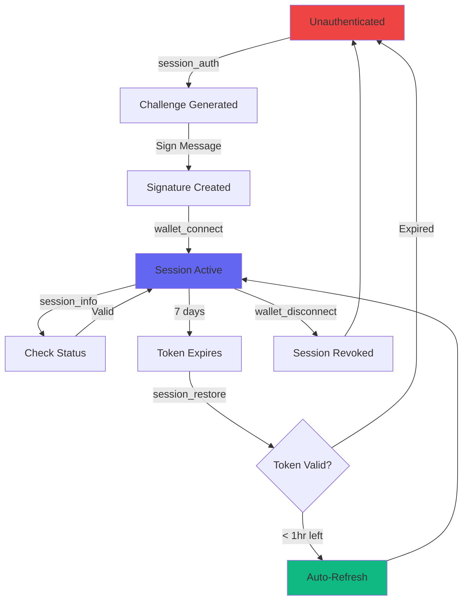

## Session Tools

Aether MCP provides 3 session management tools for authentication and session control.

### session_auth

Generate an authentication challenge for wallet signature.

**Parameters:**
- `walletAddress` (optional): Your Solana wallet address

**Returns:**
- `nonce`: Challenge identifier
- `message`: Message to sign with your wallet
- `expiresAt`: Challenge expiration time (5 minutes)

**Example:**
```json
{
  "tool": "session_auth",
  "params": {
    "walletAddress": "8FE27iak4b2yadKoogAPAGN9VnmYYZm8eUF71QhVbgNr"
  }
}
```

**Response:**
```json
{
  "success": true,
  "data": {
    "nonce": "a1b2c3d4e5f67890abcdef1234567890",
    "message": "Sign this message to authenticate with Aether MCP\n\nWallet: 8FE27iak4b2yadKoogAPAGN9VnmYYZm8eUF71QhVbgNr\nNonce: a1b2c3d4e5f67890abcdef1234567890\nTimestamp: 2024-02-06T10:15:30.123Z\n\nThis signature proves ownership of your wallet and will be used to create a secure session.",
    "expiresAt": "2024-02-06T10:20:30.123Z"
  }
}
```

<Note>
Challenges expire in **5 minutes** for security. Get a fresh challenge if expired.
</Note>

---

### session_info

Get information about your current session.

**No Parameters Required**

**Returns:**
- `walletAddress`: Authenticated wallet
- `createdAt`: Session creation timestamp
- `lastActivity`: Last activity timestamp
- `expiresAt`: Session expiration (7 days default)
- `conversationCount`: Number of marketplace conversations
- `orderCount`: Number of marketplace orders

**Example:**
```json
{
  "tool": "session_info"
}
```

**Response:**
```json
{
  "success": true,
  "data": {
    "walletAddress": "8FE27iak4b2yadKoogAPAGN9VnmYYZm8eUF71QhVbgNr",
    "createdAt": "2024-02-06T10:15:30Z",
    "lastActivity": "2024-02-06T11:45:22Z",
    "expiresAt": "2024-02-13T10:15:30Z",
    "conversationCount": 5,
    "orderCount": 2
  }
}
```

<Tip>
Use this to check if you're authenticated before calling protected tools.
</Tip>

---

### session_restore

Restore a session from a JWT token (validates and refreshes if needed).

**Parameters:**
- `token`: JWT session token from previous authentication

**Returns:**
- Session information
- New token if auto-refreshed (< 1 hour remaining)

**Example:**
```json
{
  "tool": "session_restore",
  "params": {
    "token": "eyJhbGciOiJIUzI1NiIsInR5cCI6IkpXVCJ9.eyJ3YWxsZXRBZGRyZXNzIjoiOEZFMjdpYWs0YjJ5YWRLG9vZ0FQQUdOOVZubVlZWm04ZVVGNzFRaFZiZ05yIiwic2Vzc2lvbklkIjoiNTZhYjEyMzQtNTY3OC05MGFiLWNkZWYtMTIzNDU2Nzg5MGFiIiwianRpIjoiOTBhYmNkZWYtMTIzNC01Njc4LTkwYWItY2RlZjEyMzQ1Njc4IiwiaWF0IjoxNzA3MjE3NzMwLCJleHAiOjE3MDc4MjI1MzB9.signature"
  }
}
```

**Response:**
```json
{
  "success": true,
  "data": {
    "walletAddress": "8FE27iak4b2yadKoogAPAGN9VnmYYZm8eUF71QhVbgNr",
    "sessionToken": "eyJhbGciOiJIUzI1NiIsInR5cCI6IkpXVCJ9...", // New token if refreshed
    "expiresAt": "2024-02-13T10:15:30Z",
    "refreshed": true // If token was auto-refreshed
  }
}
```

<Check>
**Auto-Refresh**: If your token expires in < 1 hour, a new token is automatically returned.
</Check>

## Session Lifecycle



## Token Revocation

### Revoke Current Session

Use `wallet_disconnect` to revoke your current session token:

```json
{
  "tool": "wallet_disconnect"
}
```

**What Happens:**
1. Current JWT token added to blacklist
2. Token becomes invalid immediately
3. Session data persists (can reconnect later)
4. Any requests with this token will fail

**Response:**
```json
{
  "success": true,
  "message": "Session disconnected successfully"
}
```

### HTTP Revocation Endpoints

For direct HTTP access (non-MCP clients):

#### Revoke Current Token

```bash
POST https://mcp-devnet.getaether.xyz/auth/revoke
Authorization: Bearer YOUR_JWT_TOKEN
```

**Response:**
```json
{
  "success": true,
  "message": "Token revoked successfully"
}
```

#### Revoke All Sessions

Emergency revocation of **all sessions** for your wallet:

```bash
POST https://mcp-devnet.getaether.xyz/auth/revoke-all
Content-Type: application/json

{
  "walletAddress": "YOUR_WALLET_ADDRESS",
  "signature": "BASE64_SIGNATURE",
  "nonce": "CHALLENGE_NONCE"
}
```

<Steps>
  <Step title="Get Challenge">
    Call `session_auth` to get a fresh challenge nonce
  </Step>
  <Step title="Sign Challenge">
    Sign the message with your wallet
  </Step>
  <Step title="Submit Revocation">
    POST to `/auth/revoke-all` with signature proof
  </Step>
</Steps>

**Response:**
```json
{
  "success": true,
  "message": "All sessions revoked successfully"
}
```

<Warning>
**Use Case**: Compromised device, lost token, security breach. After revocation, you must re-authenticate.
</Warning>

## JWT Token Structure

Tokens are standard JWTs with custom claims:

```json
{
  "walletAddress": "8FE27iak4b2yadKoogAPAGN9VnmYYZm8eUF71QhVbgNr",
  "sessionId": "uuid-v4-session-id",
  "jti": "uuid-v4-token-id",
  "iat": 1707217730,
  "exp": 1707822530,
  "iss": "aether-mcp",
  "aud": "mcp-client"
}
```

**Claims:**
- `walletAddress`: Your authenticated Solana wallet
- `sessionId`: Unique session identifier (for multi-device support)
- `jti`: JWT ID for revocation (blacklist lookup)
- `iat`: Issued at timestamp
- `exp`: Expiration timestamp (7 days from issue)
- `iss`: Issuer (aether-mcp)
- `aud`: Audience (mcp-client)

## Session Persistence

Sessions are stored in SQLite (or Redis for distributed deployments):

**Stored Data:**
- Wallet address (primary key)
- Session creation/expiration timestamps
- Last activity timestamp
- Provider profile (if registered)
- Conversation history (marketplace)
- Order history (marketplace)
- Payment references

**Persisted Across:**
- ✅ Server restarts
- ✅ MCP transport reconnections
- ✅ Different MCP clients (same wallet)

**Not Persisted:**
- ❌ JWT tokens (must store client-side)
- ❌ Dev wallets on mainnet (security)

## Best Practices

<AccordionGroup>
  <Accordion title="Token Storage">
    **Secure Storage:**
    ```javascript
    // ✅ Good: OS keychain
    const keytar = require('keytar');
    await keytar.setPassword('aether-mcp', 'session-token', token);

    // ✅ Good: Encrypted file
    const encrypted = encrypt(token, userPassword);
    fs.writeFileSync('~/.aether/session', encrypted);

    // ❌ Bad: Plain localStorage
    localStorage.setItem('token', token); // XSS risk

    // ❌ Bad: Git repository
    // Never commit tokens!
    ```
  </Accordion>

  <Accordion title="Session Lifecycle Management">
    ```javascript
    // Check session on startup
    async function ensureAuthenticated() {
      try {
        const info = await mcp.call('session_info');
        console.log('Session active:', info.data.walletAddress);
        return true;
      } catch (error) {
        // Session expired or not authenticated
        await authenticate();
      }
    }

    // Periodic session check
    setInterval(async () => {
      const info = await mcp.call('session_info');
      const expiresIn = new Date(info.data.expiresAt) - Date.now();

      if (expiresIn < 3600000) { // < 1 hour
        console.warn('Session expiring soon, refresh recommended');
      }
    }, 60000); // Check every minute
    ```
  </Accordion>

  <Accordion title="Error Handling">
    ```javascript
    async function callTool(tool, params) {
      try {
        return await mcp.call(tool, params);
      } catch (error) {
        if (error.code === 'UNAUTHENTICATED') {
          // Session expired, re-authenticate
          await authenticate();
          // Retry the call
          return await mcp.call(tool, params);
        }
        throw error;
      }
    }
    ```
  </Accordion>

  <Accordion title="Multi-Device Support">
    ```javascript
    // Each device/client gets its own sessionId
    // All sessions for same wallet share the same data

    // Device 1
    const auth1 = await authenticate(wallet);
    // sessionId: "abc-123"

    // Device 2 (same wallet)
    const auth2 = await authenticate(wallet);
    // sessionId: "def-456"

    // Both can access same conversations, orders, etc.
    // Revoke one session without affecting the other
    ```
  </Accordion>
</AccordionGroup>

## Rate Limiting

Authentication endpoints have strict rate limits to prevent brute force:

| Endpoint | Limit | Window |
|----------|-------|--------|
| `session_auth` | 5 attempts | 15 minutes |
| `/auth/challenge` | 5 attempts | 15 minutes |
| `/auth/verify` | 5 attempts | 15 minutes |
| `session_info` | 60 requests | 1 minute |

**Key Generator**: `IP address` + `wallet address`

<Warning>
After 5 failed authentication attempts, you must wait 15 minutes before trying again.
</Warning>

## Next Steps

<CardGroup cols={2}>
  <Card title="Wallet Tools" icon="wallet" href="/mcp/wallet-tools">
    Use your authenticated session
  </Card>
  <Card title="Payment Tools" icon="money-bill" href="/mcp/payment-tools">
    Create x402 payments
  </Card>
  <Card title="Marketplace" icon="store" href="/mcp/marketplace-tools">
    Register as provider or consumer
  </Card>
  <Card title="Agent Wallets" icon="robot" href="/mcp/wallet-tools#agent-wallets">
    Create autonomous wallets
  </Card>
</CardGroup>
